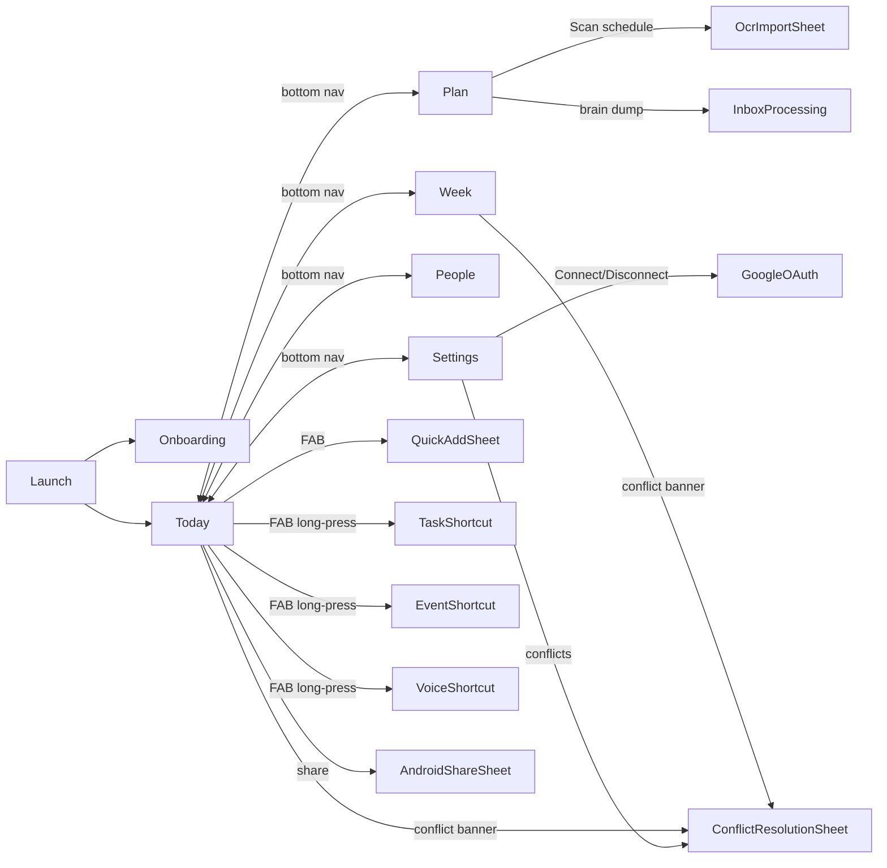

# Family Flow — Initial Design Document

**App:** Family Flow  
**Package / App ID:** `com.debanshu.xcalendar` (unchanged from the original XCalendar base)  
**Display Name:** Family Flow  
**Primary Platform:** Android (Kotlin Multiplatform; iOS and Desktop targets compile with stubs)  
**Document Date:** March 30, 2026  
**Status:** As-built reference — reflects the system after items 1–43 of AGENTS.md  

**Related documents:**
- [family_flow_baseline.md](family_flow_baseline.md) — Original architecture baseline and integration points
- [family_flow_spec_conformance_matrix.md](family_flow_spec_conformance_matrix.md) — Gap audit (items 1–16) and conformance tracking
- [instrumented_tests_implementation_summary.md](instrumented_tests_implementation_summary.md) — Instrumented test infrastructure and fake strategy
- [../README.md](../README.md) — Setup, build, and run instructions
- [../AGENTS.md](../AGENTS.md) — Guardrails, implementation history, and backlog

---

## Table of Contents

1. [Problem Statement](#1-problem-statement)
2. [Persona](#2-persona)
3. [ADHD UX Principles](#3-adhd-ux-principles)
4. [Application Overview](#4-application-overview)
5. [Screen Inventory](#5-screen-inventory)
6. [Cross-Cutting Features](#6-cross-cutting-features)
7. [Subsystems](#7-subsystems)
8. [Data Models](#8-data-models)
9. [Architecture Layers](#9-architecture-layers)
10. [Navigation Architecture](#10-navigation-architecture)
11. [Dependency Injection](#11-dependency-injection)
12. [KMP Platform Strategy](#12-kmp-platform-strategy)
13. [Tech Stack](#13-tech-stack)
14. [Security and Privacy](#14-security-and-privacy)
15. [Non-Goals](#15-non-goals)
16. [Post-Release Maintenance](#16-post-release-maintenance)
17. [Future Work and Open Hooks](#17-future-work-and-open-hooks)

---

## 1. Problem Statement

Standard calendar apps are designed for people who can maintain a bird's-eye GTD system. A parent managing a family of five with ADHD cannot. The problem is threefold:

1. **Capture friction**: Any capture flow that requires categorization before storage causes abandonment. Thoughts vanish before the form is filled.
2. **Execution paralysis**: A flat list of forty items for today is as useful as no list. The brain cannot decide where to start.
3. **People-context collapse**: Events and tasks exist in the app without connection to which family members are involved. Every item requires a mental mapping step just to know _why it matters_.

Family Flow solves these problems by being capture-first, execution-focused, and people-centric. It is not a general calendar replacement; it is a cognitive offloading shell designed for one high-load primary user (Mom) who orchestrates the schedules of a family.

---

## 2. Persona

**Mia — The Primary User**

| Attribute | Detail |
|---|---|
| Role | Mom, family scheduler, default admin |
| Household | Partner (co-parent), 3 children (preschool through elementary) |
| Context | ADHD — executive function and working memory challenges |
| Daily stress points | School pickup timing, overlapping kid activities, missed appointment prep, decision fatigue by mid-morning |
| What success looks like | Opens the app at 7 AM and immediately knows the three things that must happen today, without reading through forty items |
| App interaction style | Short bursts — opens, acts, closes. Brain dumps between tasks. Rarely sits down to "plan." |
| Failure mode (before this app) | Misses a school event, double-books a dentist appointment, forgets a soccer pickup because it was buried in Google Calendar under a shared family calendar |

**Secondary users (view-only in this phase):**
- Partner — can be assigned to tasks/events, visible in People screen, but cannot edit
- Children — each has a profile with color/avatar; used for "who's affected" filtering

---

## 3. ADHD UX Principles

Every design decision in Family Flow is traceable to one or more of the following principles. Future implementers must preserve these when adding new features.

### P1 — Capture First, Structure Later
The brain dump flow accepts raw text without any required fields. Structure (title, priority, energy, date) is applied after capture — either by the LLM, by heuristic rules, or explicitly by Mia during review. **Never block capture on categorization.**

Implemented in: `InboxItem`, `BrainDumpStructuringEngine`, Plan brain-dump inline capture.

### P2 — One Focused View (Survival Mode)
The Today screen is not a full calendar. The "Today Only" toggle strict-windows items to `active now OR starts within ±30 minutes`. "+N more" hides overflow. The goal is a mental load of 3–5 actionable items, not completeness.

Implemented in: `ScheduleEngine.passesNowWindow`, `TodayScreen`, `ScheduleFilter.nowWindowMinutes`.

### P3 — Conservative Automation (Explicit Accept, No Silent Reschedule)
The suggestion engine proposes at most two slot options (`Accept slot A | Accept slot B | Not now`). Accepting shows an undo toast. The engine never moves an item without explicit user action. OCR candidates are never auto-accepted. Brain-dump text is never auto-created as a task.

Implemented in: `ScheduleEngine.buildSuggestions`, suggestion scoring, `OcrImportSheet`, `BrainDumpStructuringEngine`.

### P4 — Persistent Context
Lens selection (`Family | Mom | Person`) survives app restarts. Routines are always sticky on the Today screen regardless of time window. The app never forgets what you were looking at.

Implemented in: `LensStateHolder` + `ILensPreferencesRepository` (DataStore), sticky routine logic in `TodayScreen`.

### P5 — Calm Visual Language
The Material3 theme uses a soft lavender-rose palette (`SoftFeminineColors`), reduced motion **ON by default**, and a warm beige background (`#F9F7F2`). High-contrast mode and text-size scale are user-configurable in Settings. Animations are gentle or absent.

Implemented in: `Theme.kt` (`SoftFeminineColors`, `SoftFeminineDarkColors`, `HighContrastFeminineColors`), `UiPreferencesRepository`, `SystemAccessibility`.

### P6 — Low-Friction Single-Tap Actions
Every Today card exposes Done / Snooze / Share with at most one tap each. No confirmation dialogs for routine actions. Snooze defaults are pre-set (no time picker required unless customizing).

Implemented in: `TodayScreen` quick actions, `UpdateTaskUseCase`, Android `ShareSheet` integration.

### P7 — Who's Affected Clarity
Every event and task carries `affectedPersonIds`. Cards display which family members are involved with color-coded avatar chips. The "Only Mom required" filter on Week applies instantly.

Implemented in: `Event.affectedPersonIds`, `Task.affectedPersonIds`, `IEventPeopleRepository` sidecar, `FamilyLensMiniHeader`.

### P8 — Energy-Aware Prioritization
Tasks carry a `TaskEnergy` field (`LOW | MEDIUM | HIGH`). The suggestion engine applies an energy match bonus when proposing time slots, matching low-energy task suggestions to low-energy time anchors. The quick-add modal exposes energy selection.

Implemented in: `Task.energy`, `ScheduleEngine` suggestion scoring (`ENERGY_ANCHOR_WEIGHT`).

### P9 — Translator-Style Human Output
OCR and brain-dump results are shown as human-readable cards, not raw JSON. The LLM structures data into a strict JSON schema internally, but the UI always presents it in natural language for review. The import classification layer adds editable category chips — the user sees "Soccer Practice" tagged `practice`, not a machine inference.

Implemented in: `OcrImportSheet`, `ImportCategoryClassifier`, `OcrStructuringEngine.structureFromLlmJson`.

### P10 — Undo Safety Net
Any destructive or high-consequence action (accept suggestion, mark done, snooze) exposes an undo pathway via a brief snackbar toast. This lowers the cognitive cost of acting — Mia can act quickly without fear of making an irreversible mistake.

Implemented in: suggestion accept/undo flow, `ErrorSnackbar`.

---

## 4. Application Overview

Family Flow is built on a **Kotlin Multiplatform + Compose Multiplatform** base targeting Android as the shipping platform. It is local-first: all data is stored in a Room database and Android DataStore on-device. Google Calendar is the only external data provider in the current phase.

### Core Modes (Bottom Navigation)

| Screen | Label | Purpose |
|---|---|---|
| Today | Survival Mode | Focused execution view for the current day |
| Week | Reality Check | 7-day overview with per-person and priority filters |
| Plan | Brain Dump + Month | Capture inbox, month overview, seasonal projects, suggestion acceptance |
| People | Family Profiles | Profile management, avatar/color editing, who's-affected lens |
| Settings | App Settings | Google Calendar OAuth, sync controls, accessibility, holiday region |

### Entry Point

`CalendarApp.kt` is the root Composable. It initializes Navigation3's `NavBackStack` with `NavigableScreen.Today` as the default destination, checks if onboarding has been completed (via `IUiPreferencesRepository`), and renders the `OnboardingScreen` over Today if first launch.

---

## 5. Screen Inventory

### 5.1 Today — Survival Mode

**Purpose:** Show Mia the minimum viable picture of today so she can act immediately.

**Key components:**
- `FamilyLensMiniHeader` — persistent avatar-aware lens selector (Family / Mom / Person) at the top
- Morning / Afternoon / Evening grouped schedule cards
- "+N more" overflow collapse
- Today Only toggle — strict ±30-minute now-window filter
- Sticky routines row — always visible regardless of time window
- "Conflicts need review" entry banner (contextual, from `SyncConflictStateHolder`)

**UX behaviors:**
- **Done**: marks task complete via `UpdateTaskUseCase`; item disappears from list; undo toast available
- **Snooze**: reschedules task or event; default snooze offsets are pre-configured (no time picker by default)
- **Share**: launches Android sharesheet (`text/plain`, SMS/WhatsApp compatible) with a Today snapshot: date, grouped items, who's affected
- **Today Only toggle**: `ScheduleFilter(nowWindowMinutes = 30)` — items must be active now or start within ±30 minutes
- Without Today Only: shows all items for the calendar day

**Data sources:** `IEventRepository`, `ITaskRepository`, `IRoutineRepository`, `LensStateHolder`, `SyncConflictStateHolder`

**Cross-screen interactions:**
- Lens selection persists to Week and Plan
- Conflict banner navigates to Settings conflict resolution sheet
- FAB opens Quick Add sheet

---

### 5.2 Week — Reality Check

**Purpose:** Give Mia a 7-day view to sanity-check the week and see where load is concentrated.

**Key components:**
- Per-day columns with person color bars (`affectedPersonIds` → `Person.color`)
- "Only Mom required" toggle — filters to items where Mom's `personId` is in `affectedPersonIds`
- "Only Must" toggle — filters to `TaskPriority.MUST` tasks and all events
- Day bottom-sheet expansion — tap a day to see full item list
- `FamilyLensMiniHeader` (shared lens, persisted)
- "Conflicts need review" entry banner

**UX behaviors:**
- Both "Only Mom required" and "Only Must" are independent, stable toggles; they do not reset on navigation
- Lens switching updates per-day column content immediately
- Who's-affected labels are consistent with Today and Plan cards

**Data sources:** `IEventRepository`, `ITaskRepository`, `LensStateHolder`, `SyncConflictStateHolder`

**Cross-screen interactions:**
- Lens selection is shared with Today and Plan
- FAB opens Quick Add sheet

---

### 5.3 Plan — Brain Dump + Month + Seasonal Projects

**Purpose:** The capture and planning hub. Mia brain-dumps whatever is in her head; the app structures it. She also reviews months and projects here.

**Key components:**
- Inline brain-dump text input — capture-first, no required fields
- Inbox list — `InboxItem` cards with status badges (`NEW / PROCESSED / ARCHIVED`)
- Processing actions per inbox item: Process → creates Task draft from `BrainDumpStructuringEngine` result; Archive → `InboxStatus.ARCHIVED`
- Month overview strip
- Year-level alert / highlight indicators
- Seasonal project cards (`Project.seasonLabel`)
- Preschool template quick-insert (morning, bedtime, pickup checklist)
- Suggestion acceptance cards — `Accept slot A | Accept slot B | Not now` with undo toast
- "Scan schedule" — launches OCR import sheet

**UX behaviors:**
- Inline capture: text is submitted as `InboxItem(status = NEW, source = TEXT)` without any categorization step
- Processing flow: `NEW → PROCESSED` (via LLM structuring + review) or `NEW → ARCHIVED`
- Brain-dump text is never auto-promoted to a Task without a processing step
- Suggestions show at most two options; "Not now" dismisses without creating an item

**Data sources:** `IInboxRepository`, `IProjectRepository`, `ITaskRepository`, `IEventRepository`, `LensStateHolder`, `ScheduleEngine` (suggestions)

**Cross-screen interactions:**
- Lens selection shared with Today and Week
- FAB opens Quick Add sheet
- "Scan schedule" opens OCR import pipeline

---

### 5.4 People — Family Profiles

**Purpose:** Manage family member profiles and understand who is in the lens.

**Key components:**
- Profile list with avatar, color swatch, role label (`MOM | PARTNER | CHILD | CAREGIVER | OTHER`)
- Avatar and color editing (Mom-admin-only)
- Role labels
- "Add child" button — opens person creation dialog

**UX behaviors:**
- **Mom is the only admin.** Any `Person` where `isAdmin = true` can edit profiles. All others are view-only.
- Color selection uses `materialKolor` to derive a full Material3 color scheme from a seed color, displayed as a swatch grid
- Age is optional; displayed contextually for children
- Archived persons (`isArchived = true`) are hidden from the active list

**Data sources:** `IPersonRepository`, `UpdatePersonUseCase`, `LensStateHolder`

**Cross-screen interactions:**
- Tapping a person in the People screen can select them as the active lens person
- Lens updates propagate immediately to Today / Week / Plan

---

### 5.5 Settings

**Purpose:** App-level configuration: Google Calendar, sync, accessibility, holiday region, conflict resolution.

**Key components:**
- Google Calendar OAuth — connect/disconnect account, select which calendars to sync
- Sync now button — triggers `SyncGoogleCalendarsUseCase(manual = true)`
- Conflict resolution sheet — list of `SyncFailure` items with suggested resolutions
- Reduced motion toggle (default: ON)
- High-contrast toggle
- Text-size scale control
- Holiday region picker (Enrico Holidays API, default USA/Utah)
- Reminder preferences

**Layout note:** Bottom padding is `104.dp` to clear Android system navigation buttons (established pattern shared with PeopleScreen, TodayScreen, WeekScreen, PlanScreen). Never reduce this below `104.dp`.

**Data sources:** `IGoogleAccountRepository`, `IUiPreferencesRepository`, `IReminderPreferencesRepository`, `IHolidayPreferencesRepository`, `SyncConflictStateHolder`

---

### 5.6 Onboarding

**Purpose:** Get Mia to Today in three screens maximum, with every step skippable.

**Flow:**
1. **Welcome + Mom profile setup** — enter name, optional avatar; seeds default `Person(role = MOM, isAdmin = true)`
2. **Kids presets** — quick add 1–3 children with age/color; seeds `Person(role = CHILD)` records
3. **Optional Google Calendar connect** — launches OAuth flow; SkipButton available; ends on `Open Today`

**UX rules:**
- Every screen has a visible Skip action
- Completing the last screen (or skipping all) navigates to `NavigableScreen.Today`
- Onboarding completion is persisted via `IUiPreferencesRepository.setOnboardingComplete(true)`
- If completed, the onboarding screen is never shown again

---

## 6. Cross-Cutting Features

### 6.1 FAB — Quick Add

The Floating Action Button is present on all main screens.

- **Tap** → opens `QuickAddSheet` in default Task mode
- **Long press** → reveals shortcut bar with Task / Event / Voice options

**QuickAddSheet modes:**
- **Task** — title (required), priority (`MUST | SHOULD | NICE`), energy (`LOW | MEDIUM | HIGH`), optional due date, optional person assignment
- **Event** — title, date/time, affected person assignment, calendar selection
- **Voice** — launches `VoiceCaptureController` (Android `SpeechRecognizer`); captured text is submitted as `InboxItem(source = VOICE)` and processed by `BrainDumpStructuringEngine`

**Accessibility:** All FAB modes have content descriptions. Touch targets are ≥48dp. Long-press reveal uses explicit visual affordance.

---

### 6.2 Family Lens Architecture

The lens is a persistent, app-wide filter that controls whose schedule is visible.

**Model:**
```kotlin
enum class FamilyLens { FAMILY, MOM, PERSON }
data class FamilyLensSelection(val lens: FamilyLens, val personId: String? = null)
```

**Runtime state:** `LensStateHolder` (Koin `@Single`) — a `StateFlow<FamilyLensSelection>` backed by `ILensPreferencesRepository` (DataStore on Android, stubs on iOS/Desktop).

**Initialization order:** On app start, `LensStateHolder` reads the persisted selection from DataStore and emits it into `_selection`. All screens collect from `LensStateHolder.selection`.

**`effectivePersonId` helper:**
```kotlin
fun FamilyLensSelection.effectivePersonId(momId: String?): String? = when (lens) {
    FamilyLens.FAMILY -> null           // no person filter
    FamilyLens.MOM    -> momId          // always Mom's ID
    FamilyLens.PERSON -> personId ?: momId
}
```

**Rendering:** `FamilyLensMiniHeader` — a reusable avatar-aware chip row shown at the top of Today, Week, and Plan. Tapping a chip calls `LensStateHolder.selectFamily()`, `.selectMom()`, or `.selectPerson(id)`.

**Why DataStore over Room?** Lens selection is a single lightweight preference value — a full Room entity would be overengineered and would require a migration for every schema change.

---

### 6.3 Event People Ownership (Sidecar)

Events imported from Google Calendar arrive with no family-member context. The `affectedPersonIds` on `Event` bridges this gap.

**Storage decision:** Rather than adding an `affectedPersonIds` column to the Room `events` table (which would require a schema migration and risk data loss for existing installs), person-event mappings are stored in a separate DataStore sidecar via `IEventPeopleRepository`.

**Android implementation:** `EventPeopleDataStoreRepository` uses `datastore-preferences` with a key per event ID. Maps are read/written as a serialized `Map<String, List<String>>`.

**KMP stubs:** `IEventPeopleRepository` has no-op implementations in `iosMain` and `desktopMain` that return empty maps and silently discard writes. KMP compilation is never broken by this feature.

**Sync reconciliation:** When Google Calendar sync writes new/updated events, `affectedPersonIds` from the sidecar are re-applied to the hydrated `Event` domain model before it reaches the UI.

---

### 6.4 Suggestion Engine

`ScheduleEngine` (in `domain/util/`) aggregates events and tasks, detects conflicts, and proposes time slots for flexible tasks.

**Scoring model (v2):**
- Base score from `ScheduleItem` position in the day
- **Conflict penalty** (`CONFLICT_PENALTY_MULTIPLIER = 10,000`) — demotes slots that overlap existing items
- **Due-date late penalty** (`DUE_DATE_LATE_PENALTY = 8,000`) — items past their due date bubble up
- **Due-date proximity bonus** — items due soon score higher (`DUE_DATE_NEAR_DIVISOR_MINUTES = 30`)
- **Routine anchor weight** (`ROUTINE_ANCHOR_WEIGHT = 1`) — prefer slots adjacent to existing routines
- **Energy match bonus** (`ENERGY_ANCHOR_WEIGHT = 1`) — prefer low-energy slots for low-energy tasks

**Daily load cap:** Default `DEFAULT_SUGGESTION_DAILY_LOAD_CAP = 5` Must/Should items per day. Configurable per invocation. Prevents the engine from overwhelming the schedule.

**Slot stepping:** `SLOT_STEP_MINUTES = 30` within `DEFAULT_DAY_START_HOUR = 7` to `DEFAULT_DAY_END_HOUR = 20`.

**UX result:** At most two suggestions are surfaced. User choices: `Accept slot A | Accept slot B | Not now`. Acceptance shows undo toast.

---

## 7. Subsystems

### 7.1 LiteRT-LM (Gemma 3 — On-Device LLM)

**Purpose:** Structure unformatted text (brain-dump, OCR output) into typed domain objects without sending any data to an external server.

**Model:** Gemma 3 1B int4 (filename: `gemma3-1b-it-int4.litertlm`). A smaller Gemma 3 270M int8 variant (`gemma3-270m-it-q8.litertlm`) is also bundled for low-memory devices.

**Model delivery:**
1. **Asset pack** — model files are placed in `composeApp/src/androidMain/assets/llm/`. Bundled in the APK at build time.
2. **Download fallback** — if the asset is not present (e.g., for a size-optimized build), `PlatformLocalLlmManager` downloads from `media.githubusercontent.com` at first use. Progress is shown in Settings.

**Runtime: `LiteRtLlmRuntime`**
- Wraps `com.google.ai.edge.litertlm.Engine`
- **GPU backend first** with CPU fallback. GPU is attempted when `LlmBackend.GPU` is configured; on incompatible devices, the factory falls back to `LlmBackend.CPU`.
- Thread-safety via `Mutex` — only one generation is active at a time
- `LocalLlmRuntimeFactory` interface enables test injection of fake runtimes

**Prompt strategy:**
- Both `OcrStructuringEngine` and `BrainDumpStructuringEngine` send a prompt that includes a strict JSON schema in the system message
- Responses are validated against the schema; if the response does not begin with `{`, the engine falls back to heuristic parsing (line-by-line or delimiter-split)
- Invalid JSON never crashes the app — `runCatching` wraps all deserialization

**LLM consumers:**
- `OcrStructuringEngine.structureFromLlmJson` — structures OCR text into `OcrStructuredResult`
- `BrainDumpStructuringEngine.structureFromLlmJson` — structures brain-dump text into `BrainDumpStructuredResult`

**KMP stubs:** `LocalLlmManager` has `expect/actual` declarations; iOS and Desktop actuals return a no-op `LocalLlmRuntime` that returns empty results without crashing.

---

### 7.2 OCR Import Pipeline (Tesseract4Android)

**Purpose:** Allow Mia to photograph a printed school schedule or paper calendar and import events without manual data entry.

**Library:** `cz.adaptech.tesseract4android:tesseract4android:4.9.0`  
**Model data:** `eng.traineddata` bundled in `composeApp/src/androidMain/assets/tessdata/` — no network requirement for OCR.

**Pipeline:**
```
Camera / Gallery capture (OcrCaptureController)
    → uCrop (image crop/rotate)
    → Tesseract4Android (raw text)
    → OcrStructuringEngine (LLM JSON → heuristic fallback)
    → ImportCategoryClassifier (keyword classification)
    → OcrImportSheet (candidate review list)
        → per-item: Accept / Edit / Discard
        → recurring-pattern prompt if detected
        → person assignment chips
        → category chip (editable: school / practice / appointment / other)
    → Accepted → EventRepository.insert(EventSource.LOCAL)
```

**`ImportCategoryClassifier`** — keyword-based, no ML. Checks title + description against keyword lists:
- `school` — "school", "preschool", "kindergarten", "class", "teacher", "field trip", "pta", "homework", "campus"
- `practice` — "practice", "soccer", "football", "basketball", "swim", "dance", "rehearsal", "training", "drill"
- `appointment` — "appointment", "doctor", "dentist", "pediatric", "therapy", "checkup", "consult", "clinic"
- Default: `OTHER`

**Recurring pattern detection:** `OcrStructuringEngine` detects weekly/monthly patterns from the raw text. If detected, an explicit `Add as recurring?` prompt is shown before acceptance. No silent recurring-event creation.

**Conservative default:** Every candidate requires an explicit `Accept`, `Edit`, or `Discard` action. No batch-accept. Category chips are editable after classification.

---

### 7.3 Google Calendar Sync

**Purpose:** Import and two-way sync selected Google Calendars. Events from Google are tagged `EventSource.GOOGLE` and treated as read-authoritative (local deletions generate conflicts rather than silently winning).

**OAuth flow:**
- Library: `net.openid:appauth:0.11.1` (PKCE, no client_secret in APK)
- Client ID sourced from `local.properties` key `ClientId` → injected via `BuildKonfig` at compile time
- Redirect URI: `com.debanshu.xcalendar:/oauth2redirect` or `com.googleusercontent.apps.<client-id>:/oauth2redirect` (derived from ClientId format)
- Token storage: `EncryptedSharedPreferences` via `androidx.security:security-crypto:1.0.0` — stored under `GoogleAccountLink`, never in plain SharedPreferences or Room

**Sync cadence:**
- **Manual** — Settings "Sync now" button → `SyncGoogleCalendarsUseCase(manual = true)`
- **Background** — `GoogleCalendarSyncWorker` (WorkManager `PeriodicWorkRequest`, 6-hour interval, `NetworkType.CONNECTED` constraint, `ExistingPeriodicWorkPolicy.KEEP`)

**`SyncGoogleCalendarsUseCase` behavior:**
1. Fetches selected calendar list from `GoogleCalendarApi`
2. Fetches events for each selected calendar since last sync
3. Deduplicates via `GoogleEventDeduplication` (matches on `externalId`)
4. Writes `Event(source = GOOGLE)` records to Room
5. Detects conflicts (remote change vs. local edit); writes `SyncFailure` records via `SyncFailureDao`
6. Updates `lastSyncedAt` on all successfully synced events

**Conflict resolution UX:**
- Conflicts are listed in Settings under "Conflict resolution"
- Contextual "Conflicts need review" banner appears on Today and Week when `SyncConflictStateHolder` has pending items
- Each conflict card offers suggested resolution actions

**`EventSource` enum semantics:**
- `LOCAL` — created in Family Flow; can be edited/deleted freely
- `GOOGLE` — imported from Google Calendar; editing creates a local override; deletion is flagged as a conflict

**Why AppAuth over a Google Sign-In SDK?** AppAuth follows the OAuth 2.0 for Native Apps best practices (RFC 8252), requires no Play Services, and works on any Android device (min SDK 30). The Google Sign-In SDK embeds a web view and requires Google Play Services.

---

### 7.4 Reminders, Timers, and Widgets

**Reminders:** `AndroidReminderScheduler` (Android-only actual of `IReminderScheduler`) schedules `AlarmManager` exact alarms for prep and start times. Notification permission is gated via `NotificationPermissionController.android.kt`. `ReminderPreferences` controls default lead time.

**Travel time buffer:** A static travel buffer (minutes) can be added in `ReminderPreferences`. It is non-route-aware by design in this phase (no Maps API key required); the user sets a fixed buffer per event type.

**Visual timers:** `TimerStateHolder` maintains countdown state for any active timed item. The timer UI is accessible from Today cards.

**Widgets (Glance):**
- `TodayWidget` — Today snapshot using `androidx.glance:glance-appwidget:1.1.0`. Shows next 3 items + current lens.
- Quick-add widget — single-tap opens QuickAddSheet via `PendingIntent`
- Widget pin flow: `WidgetPinController.android.kt` wraps `AppWidgetManager.requestPinAppWidget()`

---

## 8. Data Models

### 8.1 Event

```kotlin
data class Event(
    val id: String,               // UUID, locally generated or externalId-based
    val calendarId: String,       // references Calendar entity
    val calendarName: String,     // display name, denormalized for performance
    val title: String,
    val description: String?,
    val location: String?,
    val startTime: Long,          // epoch ms (UTC); use System.nanoTime() context only for timing
    val endTime: Long,            // epoch ms (UTC)
    val isAllDay: Boolean,
    val isRecurring: Boolean,
    val recurringRule: String?,   // RRULE string
    val reminderMinutes: List<Int>, // e.g. [15, 30]
    val color: Int,               // ARGB
    val source: EventSource,      // LOCAL | GOOGLE
    val externalId: String?,      // Google Calendar event ID
    val externalUpdatedAt: Long?, // epoch ms, from Google
    val lastSyncedAt: Long?,      // epoch ms, set by sync use case
    val affectedPersonIds: List<String>, // hydrated from IEventPeopleRepository sidecar
)

enum class EventSource { LOCAL, GOOGLE }
```

**Design note:** `affectedPersonIds` is NOT persisted in the Room `events` table. It is hydrated at read time from the DataStore sidecar (`IEventPeopleRepository`). This avoids a Room schema migration. When writing to Room, `affectedPersonIds` is intentionally discarded and persisted separately.

---

### 8.2 Task

```kotlin
data class Task(
    val id: String,
    val title: String,
    val notes: String?,
    val status: TaskStatus,           // OPEN | DONE | ARCHIVED
    val priority: TaskPriority,       // MUST | SHOULD | NICE
    val energy: TaskEnergy,           // LOW | MEDIUM | HIGH
    val type: TaskType,               // FLEXIBLE | ROUTINE | PROJECT
    val scheduledStart: Long?,        // null = unscheduled/flexible
    val scheduledEnd: Long?,
    val dueAt: Long?,
    val durationMinutes: Int,         // default 30
    val assignedToPersonId: String?,  // primary owner
    val affectedPersonIds: List<String>, // additional involved persons
    val projectId: String?,
    val routineId: String?,
    val createdAt: Long,
    val updatedAt: Long,
)

enum class TaskStatus   { OPEN, DONE, ARCHIVED }
enum class TaskPriority { MUST, SHOULD, NICE }
enum class TaskEnergy   { LOW, MEDIUM, HIGH }
enum class TaskType     { FLEXIBLE, ROUTINE, PROJECT }
```

---

### 8.3 Routine

```kotlin
data class Routine(
    val id: String,
    val title: String,
    val notes: String?,
    val timeOfDay: RoutineTimeOfDay,  // MORNING | AFTERNOON | EVENING | ANYTIME
    val recurrenceRule: String?,
    val assignedToPersonId: String?,
    val isActive: Boolean,
    val sortOrder: Int,
    val createdAt: Long,
    val updatedAt: Long,
)

enum class RoutineTimeOfDay { MORNING, AFTERNOON, EVENING, ANYTIME }
```

**Design note:** Active routines (`isActive = true`) are always shown in Today regardless of the Today Only time window. Sticky behavior is enforced in the Today screen composable, not in `ScheduleEngine`.

---

### 8.4 Person

```kotlin
data class Person(
    val id: String,
    val name: String,
    val role: PersonRole,       // MOM | PARTNER | CHILD | CAREGIVER | OTHER
    val ageYears: Int?,
    val color: Int,             // ARGB seed color; materialKolor derives full scheme
    val avatarUrl: String,
    val isAdmin: Boolean,       // true only for Mom in this phase
    val isDefault: Boolean,     // true for the 5 seeded profiles
    val sortOrder: Int,
    val isArchived: Boolean,    // soft-delete; hidden from active lists
    val createdAt: Long,
    val updatedAt: Long,
)

enum class PersonRole { MOM, PARTNER, CHILD, CAREGIVER, OTHER }
```

**Default seed profiles (created at first launch):**
`Mom (isAdmin=true, isDefault=true)`, `Partner (isDefault=true)`, `Child 1`, `Child 2`, `Child 3`.

---

### 8.5 Project

```kotlin
data class Project(
    val id: String,
    val title: String,
    val notes: String?,
    val status: ProjectStatus,  // ACTIVE | DONE | ARCHIVED
    val seasonLabel: String?,   // e.g. "Fall 2026", "Summer Camp"
    val startAt: Long?,
    val endAt: Long?,
    val ownerPersonId: String?,
    val createdAt: Long,
    val updatedAt: Long,
)

enum class ProjectStatus { ACTIVE, DONE, ARCHIVED }
```

---

### 8.6 InboxItem

```kotlin
data class InboxItem(
    val id: String,
    val rawText: String,
    val source: InboxSource,    // TEXT | VOICE | OCR
    val status: InboxStatus,    // NEW | PROCESSED | ARCHIVED
    val createdAt: Long,
    val personId: String?,      // optional person association at capture time
    val linkedTaskId: String?,  // set after processing creates a Task
)

enum class InboxStatus { NEW, PROCESSED, ARCHIVED }
enum class InboxSource { TEXT, VOICE, OCR }
```

---

### 8.7 ScheduleItem (Aggregation Model)

Not persisted. Computed by `ScheduleEngine.aggregate()` from Events and Tasks.

```kotlin
data class ScheduleItem(
    val id: String,
    val title: String,
    val startTime: Long?,
    val endTime: Long?,
    val isAllDay: Boolean,
    val priority: TaskPriority?,    // null for events
    val energy: TaskEnergy?,        // null for events
    val personIds: List<String>,    // union of assignedTo + affected
    val source: ScheduleSource,     // EVENT | TASK
    val isFlexible: Boolean,        // true when scheduledStart == null
    val originalEvent: Event?,
    val originalTask: Task?,
)
```

---

### 8.8 FamilyLens (Lens Model)

```kotlin
enum class FamilyLens { FAMILY, MOM, PERSON }

data class FamilyLensSelection(
    val lens: FamilyLens = FamilyLens.MOM,
    val personId: String? = null,
)
```

**`effectivePersonId(momId)`** resolves the concrete person ID to filter against:
- `FAMILY` → `null` (no person filter, show all)
- `MOM` → `momId`
- `PERSON` → `personId ?: momId`

---

### 8.9 OcrCandidateEvent

```kotlin
data class OcrCandidateEvent(
    val id: String,
    val title: String,
    val startDate: LocalDate?,
    val startTime: LocalTime?,
    val endTime: LocalTime?,
    val allDay: Boolean,
    val sourceText: String,     // original OCR line for human review
)
```

---

### 8.10 BrainDumpTaskDraft

```kotlin
data class BrainDumpTaskDraft(
    val title: String,
    val priority: TaskPriority?,    // null until LLM assigns or user picks
    val energy: TaskEnergy?,
    val notes: String?,
)
```

---

### 8.11 ScheduleFilter (Engine Parameters)

```kotlin
data class ScheduleFilter(
    val personId: String?,                  // null = all people
    val onlyMust: Boolean = false,
    val includeUnassignedEvents: Boolean = true,
    val nowWindowMinutes: Int? = null,      // null = full day; 30 = Today Only
)
```

---

### 8.12 ScheduleConflict / ScheduleSuggestion

```kotlin
data class ScheduleConflict(val itemIdA: String, val itemIdB: String)

data class ScheduleSuggestion(
    val taskId: String,
    val startTime: Long,
    val endTime: Long,
)
```

---

## 9. Architecture Layers

```mermaid
graph TD
    subgraph UI["UI Layer (commonMain)"]
        S[Screens<br/>Today / Week / Plan / People / Settings / Onboarding]
        SH[State Holders<br/>LensStateHolder · SyncConflictStateHolder · TimerStateHolder · ScheduleStateHolder]
        VM[ViewModels<br/>CalendarViewModel · EventViewModel]
        C[Components<br/>FamilyLensMiniHeader · QuickAddSheet · CalendarBottomNavigationBar]
    end

    subgraph Domain["Domain Layer (commonMain)"]
        UC[Use Cases<br/>UpdateTaskUseCase · SyncGoogleCalendarsUseCase · GetPeopleUseCase · …]
        E[Engines<br/>ScheduleEngine · OcrStructuringEngine · BrainDumpStructuringEngine · ImportCategoryClassifier]
        M[Models<br/>Event · Task · Person · Routine · Project · InboxItem · ScheduleItem · FamilyLensSelection]
        RI[Repository Interfaces<br/>IEventRepository · ITaskRepository · IPersonRepository · IEventPeopleRepository · … 20+ interfaces]
    end

    subgraph Data["Data Layer (commonMain / androidMain)"]
        ROOM[Room Database<br/>AppDatabase + 13 DAOs]
        DS[DataStore<br/>lens prefs · event-people sidecar · UI prefs · reminder prefs]
        STORE[Store5<br/>Event + Holiday caching]
        API[Remote APIs<br/>GoogleCalendarApi · HolidayApiService (Ktor)]
        REPO[Repository Implementations<br/>EventRepository · PersonRepository · TaskRepository · …]
    end

    subgraph Platform["Android Platform Layer (androidMain)"]
        OCR[OcrCaptureController<br/>Tesseract4Android + uCrop]
        LLM[LiteRtLlmRuntime<br/>Gemma 3 1B int4 · GPU/CPU fallback]
        OAUTH[GoogleAuthController<br/>AppAuth · PKCE]
        SYNC[GoogleCalendarSyncWorker<br/>WorkManager 6h]
        NOTIF[AndroidReminderScheduler<br/>AlarmManager]
        WIDGET[TodayWidget<br/>Glance AppWidget]
    end

    UI --> Domain
    Domain --> Data
    Platform --> Domain
    Platform --> Data
```

**Layer boundaries:**
- The UI layer never imports Room DAOs or DataStore directly. All data access flows through repository interfaces.
- The Domain layer is pure Kotlin (commonMain). It has no Android imports.
- Android-only capabilities are accessed through `expect/actual` interfaces declared in commonMain and implemented in androidMain (e.g., `OcrCaptureController`, `LocalLlmManager`, `PlatformNotifier`).
- KMP iOS and Desktop `actual` implementations are no-ops or stubs that return `supported = false` from `PlatformFeatureAvailability`.

---

## 10. Navigation Architecture

Family Flow uses **Navigation3** (`org.jetbrains.androidx.navigation3:navigation3-ui:1.0.0-alpha06`) with a typed `NavBackStack` and `@Serializable` `NavKey` objects.



**Key implementation details:**
- `NavigableScreen` is a `sealed interface` with `@Serializable` data objects for each of the 5 main destinations
- `NavBackStack` is initialized with `listOf(NavigableScreen.Today)` as the default start
- The `SerializersModule` in `CalendarApp.kt` registers polymorphic serializers for all `NavKey` subtypes (required by `SavedStateConfiguration` for correct back-stack restoration after process death)
- Bottom navigation is handled by `CalendarBottomNavigationBar`, which calls `backStack.replaceLast(destination)` on each tab tap to avoid stack accumulation

---

## 11. Dependency Injection

DI is managed by **Koin 4.1.1** with **KSP annotation processing** (`koin-annotations-bom:2.3.1`).

**Module structure:**

| Module | Location | Contents |
|---|---|---|
| `PlatformModule` | `di/Koin.kt` (commonMain expect) | `AppDatabase` singleton via `getDatabase()` `expect fun` |
| `DataModule` | `di/Koin.kt` (`@ComponentScan("com.debanshu.xcalendar.data")`) | JSON, HttpClient, DAOs, Repository implementations, Store5 factories |
| Android actuals | `androidMain/di/` | `getDatabase()` actual, platform singletons (LLM, OCR, OAuth, Widgets) |
| iOS / Desktop actuals | `iosMain/di/`, `desktopMain/di/` | `getDatabase()` actual, stub platform singletons |

**KSP configuration:**
```
ksp {
    arg("KOIN_USE_COMPOSE_VIEWMODEL", "true")
    arg("KOIN_CONFIG_CHECK", "false")   // ComponentScan compatibility
    arg("KOIN_LOG_TIMES", "true")
    arg("KOIN_DEFAULT_MODULE", "false")
}
```

**KSP compilation order:** `kspCommonMainKotlinMetadata` must run before all other KSP tasks. This is enforced by `tasks.withType(KotlinCompilationTask).configureEach { dependsOn("kspCommonMainKotlinMetadata") }` in `build.gradle.kts`.

**Reason for KSP annotation processing:** Compile-time validation reduces runtime `NoBeanDefinitionException` crashes. Manual module maintenance would be error-prone at scale with 20+ repository interfaces.

**Test injection:** Instrumented tests override production modules with `TestInstrumentedModule` (see `androidInstrumentedTest/di/TestModules.kt`), which binds fakes for `GoogleCalendarApi`, `LocalLlmManager`, and `OcrCaptureController`. Room uses in-memory configuration for all instrumented tests.

---

## 12. KMP Platform Strategy

Family Flow ships on Android only in this phase but maintains KMP compilation for iOS and Desktop. This allows a future port without rewriting the domain layer.

**`PlatformFeatureAvailability`** — `expect class` with `actual` per target:
- Android: returns `supported = true` for OCR, LLM, voice, widgets, Google sync
- iOS, Desktop: returns `supported = false` for all Android-only features

**`expect/actual` interfaces used:**
- `OcrCaptureController` — Android: Tesseract + camera; iOS/Desktop: no-op
- `LocalLlmManager` / `LiteRtLlmRuntimeFactory` — Android: Gemma 3; iOS/Desktop: stub that returns empty string
- `VoiceCaptureController` — Android: SpeechRecognizer; iOS/Desktop: no-op
- `PlatformNotifier` — Android: AlarmManager notifications; iOS/Desktop: no-op
- `IEventPeopleRepository` — Android: DataStore sidecar; iOS/Desktop: in-memory map (cleared on restart)
- `ILensPreferencesRepository` — Android: DataStore; iOS/Desktop: in-memory
- `GoogleAuthController` — Android: AppAuth; iOS/Desktop: no-op returning failure
- `WidgetPinController` — Android: AppWidgetManager; iOS/Desktop: no-op

**Rule:** Never call an Android-specific API from `commonMain`. All Android-only behavior must be behind an `expect/actual` interface.

**Guardrail:** `Clock.System.now()` is not reliable on Android in all KMP configurations. Always use `System.nanoTime()` for timing measurements and `kotlinx.datetime.Instant.fromEpochMilliseconds(...)` seeded from `System.currentTimeMillis()` for wall-clock timestamps.

---

## 13. Tech Stack

| Library / Framework | Version | Purpose | Key Usage Pattern |
|---|---|---|---|
| **Kotlin** | 2.3.0 | Primary language for all modules | — |
| **Kotlin Multiplatform** | (Kotlin 2.3.0) | Multi-target compilation | `commonMain`, `androidMain`, `iosMain`, `desktopMain` source sets |
| **Compose Multiplatform** | 1.10.0-rc02 | Declarative UI across targets | All screens and components in `commonMain` |
| **Material3 Expressive** | 1.10.0-alpha05 | Design system | `MaterialExpressiveTheme`, `SoftFeminineColors`, `HighContrastFeminineColors` |
| **materialKolor** | 4.0.5 | Dynamic color from person avatar seed | `DynamicColorScheme(seedColor = person.color)` per person chip |
| **Room** | 2.8.4 | Primary local database | 13 DAOs, `AppDatabase`, `@TypeConverters` for List fields |
| **SQLite (bundled)** | 2.6.2 | Room driver for KMP | `BundledSQLiteDriver` in `getDatabase()` actual |
| **DataStore Preferences** | 1.1.1 | Lightweight persistent preferences | Lens prefs, event-people sidecar, UI prefs, reminder prefs |
| **Koin** | 4.1.1 | Dependency injection runtime | `@Single`, `@Factory`, KoinApplication init in `XCalenderApp` |
| **Koin Annotations / KSP** | 2.3.1 | Compile-time DI validation | `@ComponentScan`, `@Module`; annotation processing via KSP |
| **Navigation3** | 1.0.0-alpha06 | Typed NavigableScreen routing | `NavBackStack`, `@Serializable NavKey`, `replaceLast()` |
| **Lifecycle / ViewModel** | 2.10.0-alpha07 | ViewModel lifecycle, `collectAsStateWithLifecycle` | `koinViewModel<>()`, `StateFlow` collection |
| **Store5** | 5.1.0-alpha07 | Offline-first caching for Event + Holiday data | `MutableStore`, `Bookkeeper`, TTL-based invalidation |
| **Ktor** | 3.3.3 | HTTP client for Holidays API | `HttpClient(OkHttp)`, `ContentNegotiation(json)`, 30s timeout |
| **kotlinx.datetime** | 0.7.1 | Cross-platform date/time | `LocalDate`, `LocalTime`, `Instant`, `TimeZone`; **not** `Clock.System.now()` |
| **kotlinx.serialization** | (Kotlin 2.3.0) | JSON for LLM schema, Ktor, NavKey | `@Serializable` data classes, `Json { ignoreUnknownKeys = true }` |
| **LiteRT-LM (litertlm-android)** | 0.9.0-alpha01 | On-device LLM inference | `Engine`, `Conversation`, `Backend.GPU/CPU`; wrapped by `LiteRtLlmRuntime` |
| **Tesseract4Android** | 4.9.0 | OCR text extraction | `TessBaseAPI`, `eng.traineddata` (bundled asset); wrapped by `OcrCapturePipeline` |
| **AppAuth** | 0.11.1 | Google Calendar OAuth 2.0 (PKCE) | `AuthorizationRequest`, `AuthorizationService`; no client_secret in APK |
| **security-crypto** | 1.0.0 | OAuth token encrypted storage | `EncryptedSharedPreferences` for `access_token` and `refresh_token` |
| **WorkManager** | 2.9.0 | Background Google Calendar sync | `PeriodicWorkRequestBuilder<GoogleCalendarSyncWorker>(6, HOURS)` |
| **Glance AppWidget** | 1.1.0 | Today + Quick-add home screen widgets | `GlanceAppWidget`, `GlanceRemoteViews`, backed by `LensStateHolder` state |
| **uCrop** | 2.2.11 | Post-capture image crop for OCR | Launched after camera/gallery capture; result passed to Tesseract |
| **Landscapist Coil3** | 2.8.2 | Avatar image loading | `GlideImage` / `CoilImage` in person chips and People screen |
| **Kermit** | 2.0.8 | KMP logging | `Logger.d(TAG) {}` replacing `android.util.Log` in common code |
| **Android Gradle Plugin** | 8.13.2 | Android build tooling | minSdk 30, compileSdk/targetSdk 36, JVM 21 |
| **Espresso Core** | 3.6.1 | Instrumented test UI interactions | `onView(withId(...))` in cross-Activity flows (camera, OAuth) |
| **UI Automator** | 2.3.0 | System-level test automation | Permission dialog handling, system navigation bar interactions |
| **Robolectric** | 4.11.1 | Fast Android unit tests without emulator | `@RunWith(RobolectricTestRunner)` for Today grouping, quick-add flow tests |

---

## 14. Security and Privacy

### Local-First Data Model
All family data — events, tasks, people profiles, routines, inbox items — lives exclusively on-device in Room and DataStore. No backend server exists in this phase. Nothing is transmitted to any third party except Google Calendar sync traffic, which is governed by the OAuth token scope.

### OAuth Token Storage
Google Calendar OAuth tokens (`access_token`, `refresh_token`) are stored exclusively in `EncryptedSharedPreferences` (AES-256 GCM key in Android Keystore). Tokens are never stored in:
- Room database
- Plain `SharedPreferences`
- Local files in external storage
- Logcat output

### No Client Secret
The `local.properties` `ClientId` value is an Android OAuth client ID only — no `client_secret` is embedded in the APK. AppAuth uses PKCE (`S256` method) for the authorization code flow. The `ClientId` is injected at build time via `BuildKonfig`; if `local.properties` is absent, the app compiles with an empty string and OAuth flows gracefully fail.

### LLM Privacy
All LLM inference (brain-dump structuring, OCR structuring) runs on-device via LiteRT-LM. No text is sent to any external server for AI processing.

### Permission Scope
- `RECORD_AUDIO` — voice capture (runtime permission, gated by `VoiceCaptureController`)
- `CAMERA` — OCR image capture (runtime permission, gated by `OcrCaptureController`)
- `ACCESS_FINE_LOCATION` / `ACCESS_COARSE_LOCATION` — travel time buffer for reminders (requested only when user enables travel buffer in Settings; not requested at install time)
- `POST_NOTIFICATIONS` — reminders (runtime permission on Android 13+)
- Network — Google Calendar sync + Holiday API (no sensitive data in holiday API calls)

### Input Validation
- LLM JSON output is validated against a strict schema before use. `runCatching` prevents malformed LLM output from crashing the app.
- OCR candidates are always shown for human review before any data is written. No auto-import.
- Google Calendar API responses are parsed defensively (`ignoreUnknownKeys = true`, null-safe field access).

---

## 15. Non-Goals

These are intentional constraints for the current phase. Future implementers must not reverse these without explicit discussion, as each has a documented reason.

| Non-goal | Reason |
|---|---|
| **No iCal / .ics file import** | Scope deferral. Would require a new parser and import pipeline. Google Calendar covers the primary sync need in this phase. |
| **No Room schema migration for event-people ownership** | Adding a Room column requires a migration that risks data loss on existing installs. The DataStore sidecar achieves the same result safely. |
| **No backend / cloud sync** | Local-first is a core design decision. Introducing a backend changes the trust model and requires authentication infrastructure. |
| **No partner or child edit permissions** | Mom is the single admin. Multi-user edit introduces merge conflicts across devices that cannot be resolved without a backend. |
| **No silent auto-reschedule** | Conservative automation is a hard ADHD UX principle (P3). The suggestion engine can propose, never decide. |
| **No batch-accept for OCR candidates** | Each candidate must be individually reviewed. Mass import of unreviewed events is a data quality risk. |
| **No real-time push notifications from Google Calendar** | WorkManager 6h polling is sufficient for the use case. Push would require a backend relay server. |
| **No multi-account Google Calendar support** | One Google account per device is sufficient for the primary use case. Multi-account adds UX complexity disproportionate to benefit. |
| **No iOS / Desktop shipping** | KMP stubs exist to keep compilation valid. A future port is architecturally possible but not a priority. |
| **No in-app purchases or subscriptions** | The app is personal-use software; no monetization is planned. |

---

## 16. Post-Release Maintenance

### Item 42 — App Icon Update

**Problem:** The original XCalendar launcher icon used the "adhdmom" branding. After renaming to Family Flow, all icons needed regeneration from the new brand image.

**Solution:** `generate_icons.sh` — a macOS shell script using `sips` (no external dependencies) that:
1. Accepts a source image path as argument
2. Fits the entire image into a padded square (preserving aspect ratio; white background for standard icons, `#F9F7F2` beige for adaptive layers)
3. Generates all Android launcher icon densities (mdpi 48px through xxxhdpi 192px)
4. Generates round variants
5. Generates adaptive foreground layers (108dp through 432dp)
6. Generates iOS app icon (1024×1024)

**Source image:** `FamilyFlow.jpeg` (1536×1024, at project root)

**Background color:** `#F9F7F2` (calm beige) — defined in `composeApp/src/androidMain/res/values/colors.xml` as `ic_launcher_background`. This value must be preserved across regenerations.

**Adaptive icon XML:** `ic_launcher.xml` and `ic_launcher_round.xml` in `mipmap-anydpi-v26/` are not modified by the script. They reference `@drawable/ic_launcher_foreground` and `@color/ic_launcher_background` which are managed separately.

**Regeneration workflow:**
```bash
./generate_icons.sh /path/to/new-icon.png
./gradlew :composeApp:assembleDebug
```

**Test:** `AppIconTest.kt` (instrumented) — 6 scenarios validating mipmap resources exist, manifest `android:icon` and `android:roundIcon` are correctly configured, and `android:label` is "Family Flow".

---

### Item 43 — Settings Screen Bottom Padding

**Problem:** On devices using Android gesture navigation (3-button or gesture bar), the Android system navigation buttons overlapped the "Sync now" button and conflict resolution cards at the bottom of the Settings screen.

**Fix:** Bottom padding on the Settings screen `Column` was changed from `.padding(16.dp)` to `.padding(start = 16.dp, top = 16.dp, end = 16.dp, bottom = 104.dp)`.

**Pattern:** `bottom = 104.dp` is the established pattern for all main screens that have scrollable content reaching the bottom edge:
- `PeopleScreen.kt` — `104.dp`
- `TodayScreen.kt` — `104.dp`
- `WeekRealityScreen.kt` — `104.dp`
- `PlanScreen.kt` — `104.dp`
- `SettingsScreen.kt` — `104.dp` ← added by this item

**Rule:** Any new scrollable screen that has content reaching the bottom of the viewport must use `bottom = 104.dp` to clear the bottom navigation bar and Android system navigation buttons. Never use a smaller value.

**Test:** `SettingsScreenLayoutTest.kt` (instrumented) — 2 scenarios validating the padding pattern and documenting the established `104.dp` value.

---

## 17. Future Work and Open Hooks

The following are known extension points. They are not committed to any backlog but are architecturally prepared for.

| Extension | Current hook | Notes |
|---|---|---|
| **iCal / .ics import** | `EventSource` enum has a slot for a third source type; `ICalendarSourceRepository` interface exists | Would need an iCal parser and an import review sheet (same pattern as OCR import) |
| **iOS native port** | All domain + data layers are in `commonMain`; all Android-only code is behind `expect/actual` | Requires SwiftUI `ContentView` wiring, actual implementations for OCR (Vision framework), LLM (Core ML or direct LiteRT), and DataStore alternatives (NSUserDefaults) |
| **Desktop Compose port** | Desktop source set compiles with stubs | Requires `ktor-client-okhttp` (already in `desktopMain`) and a desktop calendar/notification strategy |
| **Multi-account Google Calendar** | `GoogleAccountLink` model supports one account; `GoogleAccountDao` has a single-row pattern | Would require per-account token storage and merge strategy in `SyncGoogleCalendarsUseCase` |
| **Backend sync / multi-device** | No remote write path exists | Would require a sync protocol, conflict resolution strategy, and a server-side data model. The local-first Room schema is a reasonable starting point for a CRDTor diff-based sync |
| **Camera-roll recurring event detection** | `OcrStructuringEngine` detects recurring patterns from text | Could be extended to scan photo metadata (date on photo → event date) |
| **Partner edit permissions** | `Person.isAdmin` is a boolean field; could be extended per-resource | Requires UI to grant/revoke edit rights and a policy enforcement layer in use cases |
| **Customizable suggestion scoring weights** | `ScheduleEngine` constants (`CONFLICT_PENALTY_MULTIPLIER`, `ENERGY_ANCHOR_WEIGHT`, etc.) are hardcoded | Could be exposed as user-configurable sliders in Settings under an "Advanced" section |
| **Wear OS companion widget** | `TodayWidget` uses Glance; Wear OS Glance tiles have the same API surface | Would need a `:wearApp` module and a tile layout |
| **Holiday region expansion** | `HolidayPreferences.region` is user-configurable in Settings | Enrico Holidays API supports most countries; adding a country picker is low effort |
